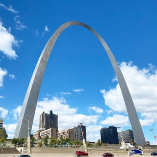
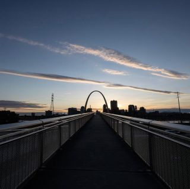
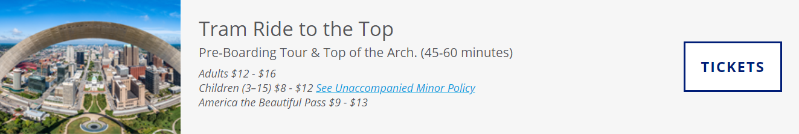
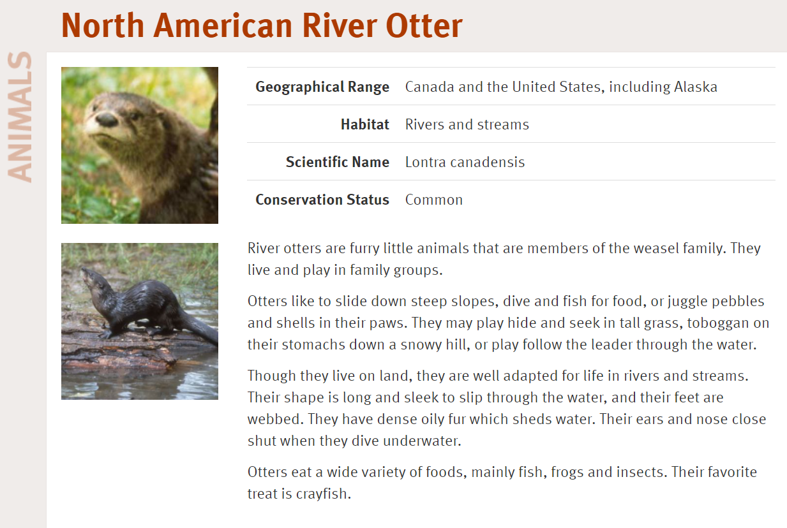

- [ToDo list](#todo-list)
- [Reference](#reference)
- [景点](#景点)
  - [1. Gateway Arch 圣路易斯大拱门](#1-gateway-arch-圣路易斯大拱门)
  - [2. Old Court House 圣路易斯老法院](#2-old-court-house-圣路易斯老法院)
  - [3. Saint Louis Zoo 圣路易斯动物园](#3-saint-louis-zoo-圣路易斯动物园)
  - [4. Saint Louis Art Museum 圣路易斯艺术博物馆](#4-saint-louis-art-museum-圣路易斯艺术博物馆)
  - [5. Missouri Botanical Garden 密苏里植物园](#5-missouri-botanical-garden-密苏里植物园)
  - [6. WUSTL](#6-wustl)
  - [7. Cathedral Basilica of St. Louis 圣路易斯大教堂](#7-cathedral-basilica-of-st-louis-圣路易斯大教堂)
  - [8. 圣路易斯拱门 > Cathedral Basilica of St. Louis > THE FOX THEATRE](#8-圣路易斯拱门--cathedral-basilica-of-st-louis--the-fox-theatre)
- [美食](#美食)
  - 
  - 
  - 
  - 
  - 

# ToDo list
1. 

# Reference
1. [惊！竟有如此详细的St. Louis 美国圣路易斯自驾游攻略？？？！](https://www.mafengwo.cn/i/7022783.html)
   2017年写的
2. 零零碎碎的web

# 景点
## 1. Gateway Arch 圣路易斯大拱门
   
   
   - 官网：https://www.gatewayarch.com/
      官网上还有The Museum at the Gateway Arch, Riverboat Cruises和Old Courthouse的介绍.

   - 门票免费。Tram Ride To The Top到顶要买门票。
      买票：https://www.gatewayarch.com/buy-tickets/
      

   - 美国西进运动的纪念性建筑。哪怕因为COVID预约困难，没有能够上到最高处，也并不影响参观周围的arch national park. Park沿密西西比河而建，对面就是我们来的 伊利诺伊州 

## 2. Old Court House 圣路易斯老法院
   - 圣路易斯最早的老法院，离Gateway Arch仅两个街区。
      建于1839年到1862年，是斯科特诉桑福德案（1857，黑人奴隶争取自由）的判决地和Virginia Minor（1824-1894）为女性争取投票权的地方。
   
## 3. Saint Louis Zoo 圣路易斯动物园
   - https://www.stlzoo.org/
      要去官网确认开园时间等等。

   - 票价：免费，里面有收费项目。

   - > All guests, including Zoo members, must now reserve free, timed tickets prior to visiting.

   - 可以先逛完免费的部分，再选择收费部分。因为很有可能免费部分逛完以后并没有其他精力再逛收费项目了。

   - 有獭獭！North American River Otter. https://www.stlzoo.org/animals/abouttheanimals/mammals/carnivores/northamericanriverotter
      

## 4. Saint Louis Art Museum 圣路易斯艺术博物馆
   - https://www.slam.org/

   - 要跟阿赖一起去的时候再补充这个。
  
   - 距离动物园非常近，步行15分钟左右，建议可以和动物园同一天游玩。

## 5. Missouri Botanical Garden 密苏里植物园
   

## 6. WUSTL

## 7. Cathedral Basilica of St. Louis 圣路易斯大教堂
   - 建于1907-1914年。大教堂无论外部还是内部都非常的庄严富丽。它的外部是罗马式建筑风格，花岗岩墙壁，玫瑰花窗，两个厚重的石塔，该堂的主保圣人是法国国王路易9世。1997年若望保禄二世将其列为宗座圣殿。该堂以马赛克装饰著称。拱形的圆顶被罗马式的尖顶窗户托举着。进入教堂的一刹那，仿佛穿越时空回到拜占庭时代。拱廊，墙壁，圆顶都贴满金碧辉煌的马赛克，总面积83000平方英尺，是二十位艺术家在整整七十五年的时间里完成的。主圣坛和内部一个小教堂的马赛克是Gorham公司完成的，而其中的意大利风格的马赛克装饰则是Tiffany公司负责的。
   - 想看图的话可以来这个链接，翻评论：https://you.ctrip.com/sight/stlouis24218/1785371.html

## 8. 圣路易斯拱门 > Cathedral Basilica of St. Louis > THE FOX THEATRE
早晨前往参观圣路易斯拱门，感受开拓精神的力量。紧接着，游览圣路易斯植物园，呼吸自然的味道。下午在室内活动，参观博物馆和大教堂，随着马赛克的裂隙窥探历史的辉煌。夜晚前往fox theater，品味戏剧文化。

# 美食
今天没时间了...明天再写。
## 

## 

## 

## 

## 

